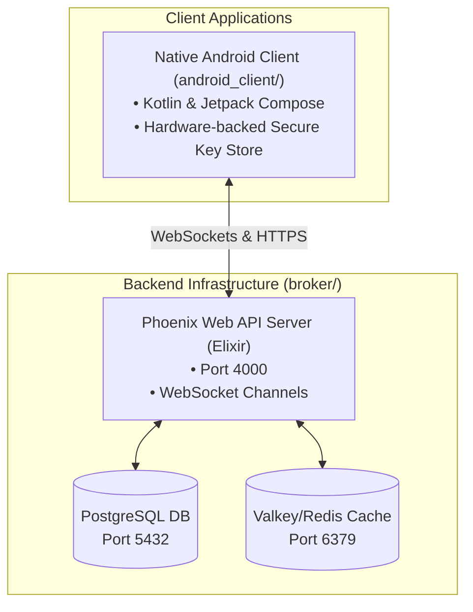

# 🔐 Aura Chat — Developer Requirements & Local Setup Guide

Welcome to the development repository for **Aura Chat**, a premium, secure end-to-end encrypted messaging application. This project is structured as a monorepo consisting of a backend service and a native mobile client application.

---

## 🧭 Project Architecture



---

## 📥 Download & Installation Quick Links

Here is a quick-reference guide containing the required versions, official download links, and installation commands using standard Windows package managers (`winget` and `scoop`).

| Dependency / Tool | Required Version | Official Download Link | CLI Installation (Windows) |
| :--- | :--- | :--- | :--- |
| **Git** | Latest Stable | 🔗 [Download Git for Windows](https://git-scm.com/download/win) | `winget install Git.Git` |
| **Docker Desktop** | Latest Stable | 🔗 [Download Docker Desktop](https://www.docker.com/products/docker-desktop/) | `winget install Docker.DockerDesktop` |
| **Android Studio** | Latest Stable | 🔗 [Download Android Studio](https://developer.android.com/studio) | `winget install Google.AndroidStudio` |
| **JDK (Java SDK)** | `17` or `21` | 🔗 [Download Microsoft OpenJDK 17](https://learn.microsoft.com/en-us/java/openjdk/download) or [Azul Zulu JDK 17](https://www.azul.com/downloads/?package=jdk#zulu) | `winget install Microsoft.OpenJDK.17` |
| **Erlang/OTP** | `26.0` | 🔗 [Download Erlang/OTP 26.0](https://www.erlang.org/patches/otp-26.0) | `scoop install erlang@26.0` or installer |
| **Elixir** | `1.15.4` | 🔗 [Download Elixir Installer](https://elixir-lang.org/install.html#windows) | `scoop install elixir@1.15.4` or installer |
| **VS Code** *(Optional)* | Latest Stable | 🔗 [Download VS Code](https://code.visualstudio.com/Download) | `winget install Microsoft.VisualStudioCode` |

---

## 🖥️ 1. Global Development Requirements

To set up your workstation for development, you must install the following core tools. Note that these instructions are optimized for **Windows**.

### 1.1 Core Tooling
1. **Git**: Version control tool.
   * [Download Git for Windows](https://git-scm.com/download/win)
2. **Docker Desktop**: Required to host database and cache services locally without manual server installation.
   * [Download Docker Desktop](https://www.docker.com/products/docker-desktop/)
   * *Ensure WSL 2 integration is enabled during installation.*
3. **IDE (Integrated Development Environment)**:
   * **Android Studio (Latest stable edition, e.g., Ladybug / Koala)**: Crucial for compilation, Gradle tasks, and Android emulation.
     * [Download Android Studio](https://developer.android.com/studio)
   * **Visual Studio Code (Optional)**: Ideal for editing Elixir code.
     * Recommended Extensions:
       * *ElixirLS* (Elixir Support)
       * *Kotlin* extension (if editing Kotlin files outside Android Studio)

---

## 🛠️ 2. Elixir Backend (Broker) Requirements

The backend service is built using the **Elixir** language and the **Phoenix Framework**.

### 2.1 Dependencies & Versions
* **Erlang/OTP**: `26.0`
* **Elixir**: `1.15.4` (matches CI container configuration)
* **PostgreSQL**: `15` (delivered via Docker)
* **Valkey / Redis**: Latest (delivered via Docker)

### 2.2 Windows Installation Guide for Elixir
To run the backend natively without Docker (though Docker can containerize it, running locally is usually faster for debugging):
1. **Using Scoop (Recommended)**:
   ```powershell
   scoop install erlang@26.0
   scoop install elixir@1.15.4
   ```
2. **Using Chocolatey**:
   ```powershell
   choco install erlang --version=26.0
   choco install elixir --version=1.15.4
   ```
3. **Using Pre-compiled Installers**:
   * [Erlang/OTP Download](https://www.erlang.org/patches/otp-26.0)
   * [Elixir Windows Installer](https://elixir-lang.org/install.html#windows)

---

## 🤖 3. Native Android Client (`android_client`) Requirements

The native client is built in Kotlin using modern declarative UI with Jetpack Compose.

### 3.1 Dependencies & SDK Targets
* **Java Development Kit (JDK)**: **JDK 17** or **JDK 21**. (Required by Android Gradle Plugin `9.0.1` to compile the build files).
  * *Ensure `JAVA_HOME` environment variable points to your JDK directory.*
* **Kotlin**: `2.0.21`
* **Android Gradle Plugin (AGP)**: `9.0.1`
* **Compile SDK Version**: `36` (Android 15+)
* **Min SDK Version**: `26` (Android 8.0 Oreo)
* **Target SDK Version**: `35` (Android 15)

### 3.2 SDK Manager Setup in Android Studio
Ensure you have downloaded the following packages via **Android Studio** ➜ **Settings** ➜ **Languages & Frameworks** ➜ **Android SDK**:
1. **SDK Platforms**: Android 15.0 ("VanillaIceCream") (API 35/36)
2. **SDK Tools**:
   * Android SDK Build-Tools
   * Android SDK Command-line Tools
   * Android Emulator
   * Android SDK Platform-Tools

---

## 🚀 4. Local Setup & Execution Steps

Follow these steps sequentially to spin up the entire development ecosystem on your machine:

### Step 4.1: Launch Docker Services
From the repository root, run the Docker Compose commands to launch PostgreSQL and Valkey:
```powershell
docker compose up -d
```
> [!NOTE]
> This spins up:
> - **PostgreSQL** on `localhost:5432` with username `postgres`, password `password`, database `broker_dev`.
> - **Valkey (Redis)** on `localhost:6379` for session key rate-limiting.

---

### Step 4.2: Configure & Start Elixir Broker
Navigate to the `broker/` directory:
```powershell
cd broker
```
1. **Install Hex/Rebar**:
   ```powershell
   mix local.hex --force
   mix local.rebar --force
   ```
2. **Fetch Dependencies & Setup Database**:
   ```powershell
   mix setup
   ```
   *This command runs `mix deps.get` and compiles the migrations to set up database schemas.*
3. **Start the API Server**:
   ```powershell
   mix phx.server
   ```
   *The server starts listening on `http://localhost:4000` (WebSocket endpoint: `ws://localhost:4000/socket/websocket`).*

---

### Step 4.3: Network Configuration (Crucial for Emulators)
If you run the client in an Android Emulator or on a physical device, they will not be able to connect to `localhost:4000`. You must configure the server IP:

#### For Native Android Client (`android_client/`):
Edit [AppConfig.kt](file:///d:/Messaging_App/android_client/app/src/main/java/com/subhankar/aurachat/network/AppConfig.kt):
* Adjust `serverIp` to match either `10.0.2.2` (for emulator) or your local network IP:
  ```kotlin
  var serverIp: String = "10.0.2.2"
  ```

---

### Step 4.4: Running the Native Android Client
1. Open the folder `android_client/` in **Android Studio**.
2. Wait for Gradle sync to complete. (It will automatically generate the local `local.properties` file with your SDK path).
3. Connect an emulator or physical device.
4. Click the **Run** button (green play icon) or build via Gradle:
   ```powershell
   cd android_client
   ./gradlew assembleDebug
   ```

---

## 🗂️ Verification Cheat Sheet
| Component | Status Check | Target Address |
| --- | --- | --- |
| **PostgreSQL** | Docker Desktop Container running | `localhost:5432` |
| **Valkey/Redis** | Docker Desktop Container running | `localhost:6379` |
| **Phoenix Broker** | `mix phx.server` running | `http://localhost:4000/` |
| **Mailbox UI** | Elixir Swoosh dev preview | `http://localhost:4000/dev/mailbox` |
| **Phoenix Dashboard**| App Telemetry | `http://localhost:4000/dev/dashboard` |
| **Android SDK** | JDK version 17+ installed | `java -version` |
